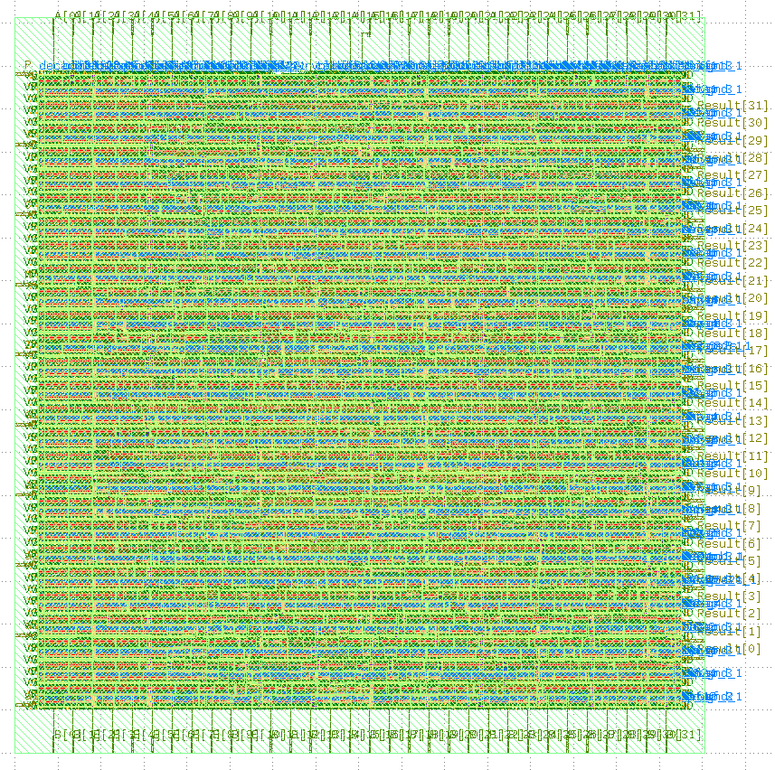
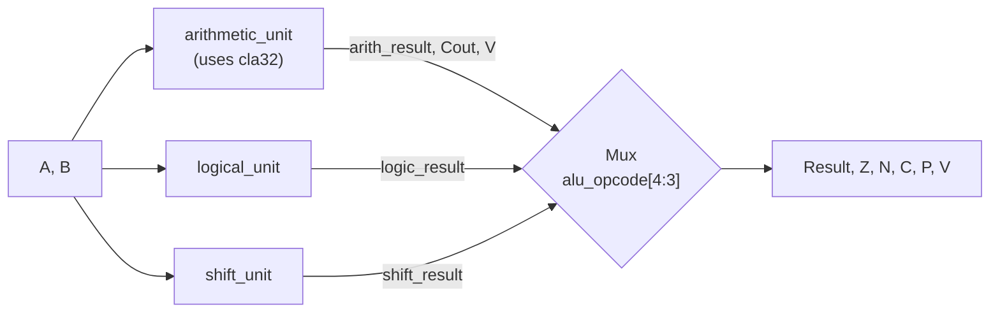
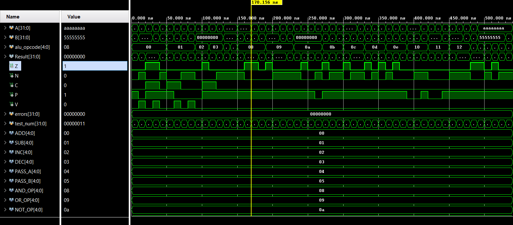

# 32-bit ALU — RTL-to-GDSII ASIC Design Flow

<p align="center">
  
</p>

A modular, fully-verified 32-bit Arithmetic Logic Unit written in Verilog, built as an end-to-end learning project covering the complete chip design pipeline: **specification → RTL → functional verification → logic synthesis → physical design → GDSII**, using the open-source ASIC toolchain (Yosys, OpenLane2, OpenROAD, OpenSTA, Magic, Netgen) targeting the SkyWater SKY130 process design kit (PDK).

---

## Table of Contents
- [Overview](#overview)
- [Project Highlights](#project-highlights)
- [Architecture](#architecture)
- [Instruction Set / Opcode Map](#instruction-set--opcode-map)
- [Flags](#flags)
- [Repository Structure](#repository-structure)
- [Verification Strategy & Results](#verification-strategy--results)
- [Toolchain](#toolchain)
- [Known Limitations / Future Work](#known-limitations--future-work)
- [Project Status](#project-status)
- [Physical Design Results](#physical-design-results)

---

## Overview

This project implements a 32-bit ALU supporting arithmetic, logical, and shift operations, decomposed into independently-designed and independently-verified submodules rather than a single flat module. The goal is twofold:

1. **Design**: a correct, synthesizable, hierarchically-built 32-bit ALU.
2. **Process**: a hands-on walkthrough of the real RTL-to-GDSII flow used in industry — substituting open-source EDA tools (Yosys, OpenROAD, Magic) for their commercial equivalents (Synopsys/Cadence) at every stage, on the free SkyWater 130nm (sky130) process.

---

## Project Highlights

- Hierarchical 32-bit Carry Lookahead Adder (CLA4 → CLA8  → CLA32)
- 16 ALU operations across Arithmetic, Logical, and Shift units
- Modular RTL design with independent submodules
- Self-checking Verilog testbenches
- Exhaustive verification where feasible
- Directed edge-case verification for larger modules
- Successfully completed the complete RTL-to-GDSII open-source ASIC flow using OpenLane2 (SKY130)
- Final manufacturable GDSII generated
- DRC and LVS clean implementation

  ---

## Architecture

The ALU's 32-bit adder is **not** a single flat carry-lookahead block — it's built hierarchically from smaller carry-lookahead blocks chained together, a practical middle ground between a full ripple-carry adder (slow, simple) and a true 32-bit lookahead tree (fast, complex):

```
cla4 → cla8 → cla16 → cla32
```

Each stage doubles the width by instantiating two of the previous stage and rippling a single carry bit between them — carry only ripples *between* blocks, not within them.

Top-level ALU datapath:



`alu_opcode[4:3]` selects the **mode** (which unit drives `Result`); `alu_opcode[2:0]` selects the **operation** within that unit. Only one unit is ever enabled at a time — the other two are gated off via dedicated enable signals (`arith_enable`, `logic_enable`, `shift_enable`), and `C`/`V` are explicitly forced to `0` outside arithmetic mode so they never carry stale or meaningless values from the (disabled) adder.

---

## Instruction Set / Opcode Map

`alu_opcode` is 5 bits: `{mode[1:0], op[2:0]}`
<div align="center">

| Mode (`[4:3]`) | Op (`[2:0]`) | Mnemonic | Operation |
|:--------------:|:------------:|:--------:|:---------:|
| `00` ARITHMETIC | `000` | ADD | `A + B` |
| `00` | `001` | SUB | `A - B` |
| `00` | `010` | INC | `A + 1` |
| `00` | `011` | DEC | `A - 1` |
| `00` | `100` | PASS_A | `A` |
| `00` | `101` | PASS_B | `B` |
| `01` LOGICAL | `000` | AND | `A & B` |
| `01` | `001` | OR | `A \| B` |
| `01` | `010` | NOT | `~A` |
| `01` | `011` | XOR | `A ^ B` |
| `01` | `100` | NAND | `~(A & B)` |
| `01` | `101` | NOR | `~(A \| B)` |
| `01` | `110` | XNOR | `~(A ^ B)` |
| `10` SHIFT | `000` | SLL | `A << B[4:0]` |
| `10` | `001` | SRL | `A >> B[4:0]` |
| `10` | `010` | SRA | `A >>> B[4:0]` (sign-extending) |
| `11` | — | — | Undefined — `Result = 0`, all flags `0` |

</div>

Shift amount is taken from the lower 5 bits of `B` (`B[4:0]`), allowing shifts of 0–31 bits.

## Flags

<div align="center">
  
| Flag | Meaning | Behavior |
|---|---|---|
| `Z` | Zero | `1` if `Result == 0`, for any opcode |
| `N` | Negative | `Result[31]` (sign bit), for any opcode |
| `C` | Carry | Adder's carry-out — **only meaningful in ARITHMETIC mode**, forced to `0` otherwise |
| `V` | Overflow | Signed two's-complement overflow — **only meaningful in ARITHMETIC mode**, forced to `0` otherwise |
| `P` | Parity | `1` if `Result` has an **even** number of set bits (computed via reduction-XNOR, `~^Result`) |
  
</div>

`C` and `V` are derived from the adder's *actual* internal operands (post operand-selection, e.g. `~B` for subtraction), not the user-facing `A`/`B` directly — this is what lets a single overflow formula correctly cover ADD, SUB, INC, and DEC simultaneously without per-opcode special-casing.

---

## Repository Structure

```
32-bit_ALU/
├── README.md
├── .gitignore
├── docs/
│   ├── waveforms/                 
│   └── reports/                  
├── rtl/
│   ├── cla4.v / cla8.v / cla32.v   
│   ├── arithmetic_unit.v
│   ├── logical_unit.v
│   ├── shift_unit.v
│   └── alu32.v                    # top-level ALU
├── tb/
│   ├── tb_cla4.v                  
│   ├── tb_arithmetic_unit.v       
|   ├── tb_logical_unit.v      
|   ├── tb_shift_unit.v      
│   ├── tb_alu32.v                 
├── fpga/vivado/                   
├── asic_openlane
│   ├── asic_results   
│   ├── src
│   ├── config.yaml
│   └── pin_order.cfg             
```

---

## Verification Strategy & Results

Verification effort was scaled to each module's feasibility — exhaustive where the input space allowed it, directed edge-case testing where it didn't:

| Module | Strategy | Result |
|---|---|---|
| `cla4` | **Exhaustive** — all 512 combinations of `A`, `B`, `Cin` (9 input bits, fully enumerable) | ✅ 512 / 512 passing |
| `arithmetic_unit` | **Directed edge cases** — signed-overflow boundaries in *both* directions for ADD/SUB/INC/DEC, carry-vs-overflow distinction (`Cout=1` with `V=0` and vice versa), wrap-around behavior, every opcode with `arith_enable=0`, undefined-opcode default | ✅ All passing |
| `alu32` (top-level) | **Directed, self-checking, full-opcode coverage** — every arithmetic/logical/shift operation, undefined-opcode handling, cross-unit integration sanity checks | ✅ 54 / 54 passing |

<p align="center">
  
</p>

**Engineering note on the top-level testbench:** `Z`, `N`, and `P` are pure functions of `Result` — rather than hand-computing and hardcoding them per test vector (error-prone at 32-bit width; an earlier draft of this testbench had several incorrect hand-counted parity values), the testbench derives them algorithmically inside the self-check task from the expected result. Only `C` and `V` — which require actual knowledge of the adder's internal carry chain — are hand-supplied per test. This eliminates an entire class of testbench bugs and makes adding new test vectors less error-prone going forward.

All simulation was run in Vivado (XSim); waveform screenshots are checked into `docs/waveforms/` respectively as visibility artifacts.

---

## Synthesis Results (Yosys, sky130_fd_sc_hd)
- Cells: 1,053
- Chip area: 10,067.16 µm²
- Sequential elements: 0% (confirms fully combinational design)

---
## Toolchain

| Stage | Tool Used | Commercial Equivalent |
|---|---|---|
| RTL Coding | Vivado source editor | Cadence Xcelium, Synopsys Verdi |
| Functional Verification | Vivado Simulator (XSim) | QuestaSim, Synopsys VCS |
| Logic Synthesis | Yosys | Cadence Genus, Synopsys Design Compiler |
| Static Timing Analysis | OpenSTA via OpenLane | Synopsys PrimeTime |
| Floorplan / Placement / CTS / Routing | OpenROAD via OpenLane2 | Cadence Innovus |
| Physical Verification (DRC/LVS) | Magic + Netgen | Siemens Calibre |
| GDSII Generation | Magic | Cadence Innovus |
| PDK | SkyWater sky130 (open) | TSMC / Samsung / GF (proprietary) |

---

## Known Limitations / Future Work

- The ALU does not currently expose an external carry-in at the top level (useful for chaining multiple ALUs for >32-bit arithmetic) — a possible future extension.
- `logical_unit` and `shift_unit` are currently verified only via top-level integration tests in `tb_alu32.v`, not standalone exhaustive/directed testbenches of their own.
- The current implementation is a fully combinational ALU; therefore, Clock Tree Synthesis (CTS) is intentionally skipped.
- Timing closure has been verified for the synthesized combinational design under the SKY130 standard-cell library.
- Future work includes pipelining the ALU, exposing an external carry-in/carry-out interface, and extending the instruction set with multiplication, comparison, and rotate operations.

---

## Project Status
- [x] Specification & Architecture
- [x] RTL Coding (modular hierarchy)
- [x] Functional Verification (54/54 tests passing)
- [x] Logic Synthesis (Yosys + sky130)
- [x] Physical Design (OpenLane2)
- [x] DRC Clean
- [x] LVS Clean
- [x] GDSII Generated

---

## Physical Design Results

The complete ASIC implementation was carried out using OpenLane2 targeting the SKY130 HD standard-cell library.

Completed stages include:

- RTL synthesis using Yosys
- Static Timing Analysis using OpenSTA
- Floorplanning
- Power Distribution Network generation
- Global and Detailed Placement
- Global and Detailed Routing
- Design Rule Checking (DRC)
- Layout Versus Schematic (LVS)
- Final GDSII generation

The generated GDSII has been successfully visualized using Magic VLSI and KLayout.
---
