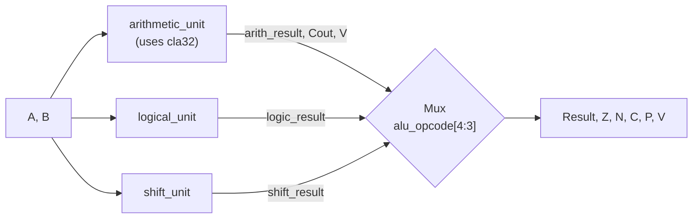

# 32-bit ALU — RTL-to-GDSII ASIC Design Flow

A modular, fully-verified 32-bit Arithmetic Logic Unit written in Verilog, built as an end-to-end learning project covering the complete chip design pipeline: **specification → RTL → functional verification → logic synthesis → physical design → GDSII**, using the same open-source EDA stack (Yosys, OpenROAD/OpenLane, Magic, Netgen, SkyWater sky130 PDK) that the open-silicon community uses for real tapeouts.

---

## Table of Contents
- [Overview](#overview)
- [Architecture](#architecture)
- [Instruction Set / Opcode Map](#instruction-set--opcode-map)
- [Flags](#flags)
- [Repository Structure](#repository-structure)
- [Verification Strategy & Results](#verification-strategy--results)
- [Toolchain](#toolchain)
- [Project Status](#project-status)
- [Getting Started](#getting-started)
- [Known Limitations / Future Work](#known-limitations--future-work)
- [License](#license)

---

## Overview

This project implements a 32-bit ALU supporting arithmetic, logical, and shift operations, decomposed into independently-designed and independently-verified submodules rather than a single flat module. The goal is twofold:

1. **Design**: a correct, synthesizable, hierarchically-built 32-bit ALU.
2. **Process**: a hands-on walkthrough of the real RTL-to-GDSII flow used in industry — substituting open-source EDA tools (Yosys, OpenROAD, Magic) for their commercial equivalents (Synopsys/Cadence) at every stage, on the free SkyWater 130nm (sky130) process.

---

## Project Highlights

- Hierarchical 32-bit Carry Lookahead Adder (CLA4 → CLA8  → CLA32)
- 16 ALU operations across Arithmetic, Logical, and Shift units
- Modular RTL design with independent submodules
- Self-checking Verilog testbenches
- Exhaustive verification where feasible
- Directed edge-case verification for larger modules
- 54/54 top-level ALU integration tests passing
- Targeting complete RTL-to-GDSII open-source ASIC flow (Sky130)

  ---

## Architecture

The ALU's 32-bit adder is **not** a single flat carry-lookahead block — it's built hierarchically from smaller carry-lookahead blocks chained together, a practical middle ground between a full ripple-carry adder (slow, simple) and a true 32-bit lookahead tree (fast, complex):

```
cla4 → cla8 → cla16 → cla32
```

Each stage doubles the width by instantiating two of the previous stage and rippling a single carry bit between them — carry only ripples *between* blocks, not within them.

Top-level ALU datapath:



`alu_opcode[4:3]` selects the **mode** (which unit drives `Result`); `alu_opcode[2:0]` selects the **operation** within that unit. Only one unit is ever enabled at a time — the other two are gated off via dedicated enable signals (`arith_enable`, `logic_enable`, `shift_enable`), and `C`/`V` are explicitly forced to `0` outside arithmetic mode so they never carry stale or meaningless values from the (disabled) adder.

---

## Instruction Set / Opcode Map

`alu_opcode` is 5 bits: `{mode[1:0], op[2:0]}`

| Mode (`[4:3]`) | Op (`[2:0]`) | Mnemonic | Operation |
|---|---|---|---|
| `00` ARITHMETIC | `000` | ADD | `A + B` |
| `00` | `001` | SUB | `A - B` |
| `00` | `010` | INC | `A + 1` |
| `00` | `011` | DEC | `A - 1` |
| `00` | `100` | PASS_A | `A` |
| `00` | `101` | PASS_B | `B` |
| `01` LOGICAL | `000` | AND | `A & B` |
| `01` | `001` | OR | `A \| B` |
| `01` | `010` | NOT | `~A` |
| `01` | `011` | XOR | `A ^ B` |
| `01` | `100` | NAND | `~(A & B)` |
| `01` | `101` | NOR | `~(A \| B)` |
| `01` | `110` | XNOR | `~(A ^ B)` |
| `10` SHIFT | `000` | SLL | `A << B[4:0]` |
| `10` | `001` | SRL | `A >> B[4:0]` |
| `10` | `010` | SRA | `A >>> B[4:0]` (sign-extending) |
| `11` | — | — | Undefined — `Result = 0`, all flags `0` |

Shift amount is taken from the lower 5 bits of `B` (`B[4:0]`), allowing shifts of 0–31 bits.

## Flags

| Flag | Meaning | Behavior |
|---|---|---|
| `Z` | Zero | `1` if `Result == 0`, for any opcode |
| `N` | Negative | `Result[31]` (sign bit), for any opcode |
| `C` | Carry | Adder's carry-out — **only meaningful in ARITHMETIC mode**, forced to `0` otherwise |
| `V` | Overflow | Signed two's-complement overflow — **only meaningful in ARITHMETIC mode**, forced to `0` otherwise |
| `P` | Parity | `1` if `Result` has an **even** number of set bits (computed via reduction-XNOR, `~^Result`) |

`C` and `V` are derived from the adder's *actual* internal operands (post operand-selection, e.g. `~B` for subtraction), not the user-facing `A`/`B` directly — this is what lets a single overflow formula correctly cover ADD, SUB, INC, and DEC simultaneously without per-opcode special-casing.

---

## Repository Structure

```
alu32-rtl2gdsii/
├── README.md
├── LICENSE
├── .gitignore
├── .github/workflows/ci.yml      # automated simulation on every push
├── docs/
│   ├── architecture.md           # detailed design notes / decision log
│   ├── waveforms/                 # exported simulation waveform screenshots
│   └── reports/                   # synthesis / STA / sim summary reports
├── rtl/
│   ├── half_adder.v
│   ├── full_adder.v
│   ├── cla4.v / cla8.v / cla16.v / cla32.v   # hierarchical carry-lookahead adder
│   ├── arithmetic_unit.v
│   ├── logical_unit.v
│   ├── shift_unit.v
│   └── alu32.v                    # top-level ALU
├── tb/
│   ├── tb_cla4.v                  # exhaustive (512/512 vectors)
│   ├── tb_arithmetic_unit.v       # directed edge-case verification
│   ├── tb_alu32.v                 # directed, self-checking, full-opcode coverage
│   └── *.wcfg                     # Vivado waveform configs (signal layout, reproducible)
├── fpga/vivado/                   # Vivado project (RTL design + XSim simulation only — gitignored)
├── synth/                         # Yosys synthesis script + timing constraints (planned)
├── pnr/openlane/                  # OpenLane2 config for sky130 (planned)
└── gds/                           # final GDSII output (planned)
```

---

## Verification Strategy & Results

Verification effort was scaled to each module's feasibility — exhaustive where the input space allowed it, directed edge-case testing where it didn't:

| Module | Strategy | Result |
|---|---|---|
| `cla4` | **Exhaustive** — all 512 combinations of `A`, `B`, `Cin` (9 input bits, fully enumerable) | ✅ 512 / 512 passing |
| `arithmetic_unit` | **Directed edge cases** — signed-overflow boundaries in *both* directions for ADD/SUB/INC/DEC, carry-vs-overflow distinction (`Cout=1` with `V=0` and vice versa), wrap-around behavior, every opcode with `arith_enable=0`, undefined-opcode default | ✅ All passing |
| `alu32` (top-level) | **Directed, self-checking, full-opcode coverage** — every arithmetic/logical/shift operation, undefined-opcode handling, cross-unit integration sanity checks | ✅ 54 / 54 passing |

**Engineering note on the top-level testbench:** `Z`, `N`, and `P` are pure functions of `Result` — rather than hand-computing and hardcoding them per test vector (error-prone at 32-bit width; an earlier draft of this testbench had several incorrect hand-counted parity values), the testbench derives them algorithmically inside the self-check task from the expected result. Only `C` and `V` — which require actual knowledge of the adder's internal carry chain — are hand-supplied per test. This eliminates an entire class of testbench bugs and makes adding new test vectors less error-prone going forward.

All simulation was run in Vivado (XSim); waveform configurations and screenshots are checked into `tb/` and `docs/waveforms/` respectively as reproducibility/visibility artifacts.

---

## Synthesis Results (Yosys, sky130_fd_sc_hd)
- Cells: 1,053
- Chip area: 10,067.16 µm²
- Sequential elements: 0% (confirms fully combinational design)

---
## Toolchain

| Stage | Tool Used | Commercial Equivalent |
|---|---|---|
| RTL Coding | Vivado source editor | Cadence Xcelium, Synopsys Verdi |
| Functional Verification | Vivado Simulator (XSim) | QuestaSim, Synopsys VCS |
| Logic Synthesis | Yosys | Cadence Genus, Synopsys Design Compiler |
| Static Timing Analysis | OpenSTA via OpenLane | Synopsys PrimeTime |
| Floorplan / Placement / CTS / Routing | OpenROAD via OpenLane2 | Cadence Innovus |
| Physical Verification (DRC/LVS) | Magic + Netgen | Siemens Calibre |
| GDSII Generation | Magic | Cadence Innovus |
| PDK | SkyWater sky130 (open) | TSMC / Samsung / GF (proprietary) |

---

## Project Status

- [x] Specification
- [x] Architecture
- [x] RTL Coding — `cla4/8/32` → `arithmetic_unit` / `logical_unit` / `shift_unit` → `alu32`
- [x] Functional Verification — `cla4` (exhaustive, 512/512), `arithmetic_unit` (directed edge cases), `alu32` top-level (54/54 directed tests passing)
- [ ] RTL Lint / Schematic Check
- [ ] Logic Synthesis (Yosys)
- [ ] Physical Design (OpenLane2 + sky130 PDK)
- [ ] GDSII Generation

---

## Getting Started

### Simulate in Vivado
1. Open the project in `fpga/vivado/`.
2. Add all sources under `rtl/` (Design Sources) and the relevant file under `tb/` (Simulation Sources).
3. Set the desired testbench as top, then **Run Behavioral Simulation**.

### Simulate with Icarus Verilog (CLI / CI)
```bash
iverilog -o sim_out rtl/*.v tb/tb_alu32.v
vvp sim_out
```

---

## Known Limitations / Future Work

- The ALU does not currently expose an external carry-in at the top level (useful for chaining multiple ALUs for >32-bit arithmetic) — a possible future extension.
- `logical_unit` and `shift_unit` are currently verified only via top-level integration tests in `tb_alu32.v`, not standalone exhaustive/directed testbenches of their own.
- Logic synthesis, static timing analysis, floorplanning, place & route, physical verification, and GDSII generation have not yet been run — RTL is functionally verified but not yet hardened to silicon.

---

## License

This project is licensed under the MIT License — see [`LICENSE`](LICENSE) for details.
